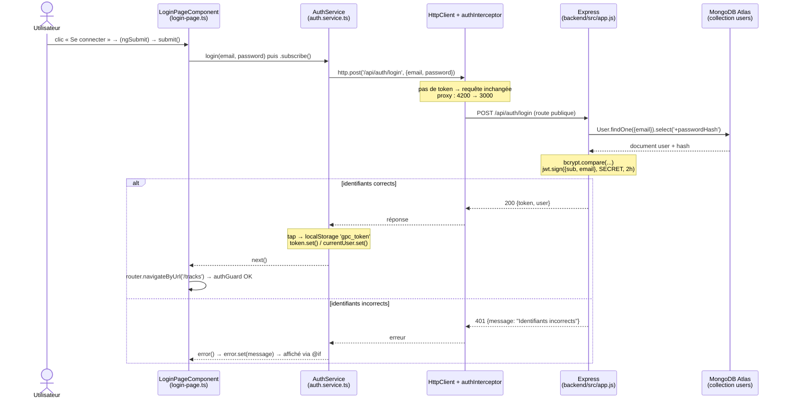

# Rapport d'usage de l'IA — TP1

Pour chaque mission, détailler et fournir des explications concernant : objectif ; prompt principal ; plan proposé par l'agent ; vérifications réalisées par le binôme ; erreurs ou propositions rejetées ; fichiers effectivement modifiés ; preuve de fonctionnement ; ce que chaque membre sait maintenant expliquer sans l'agent.

---

## Outils utilisés

| Phase | Assistant | Modèle | Mode |
|---|---|---|---|
| Exploration initiale (M0) | Claude Application (web/desktop) | `claude-opus-5-5` | Clonage du dépôt GitHub, lecture de fichiers, aucune modification du dépôt |
| Complétion du code (M1) + rapport | Claude Code CLI dans VS Code | `claude-sonnet-4-6` | Accès direct au workspace, lecture + modification des fichiers du projet |

**Consommation de tokens :** l'application web Claude n'affiche pas de compteur exact par message ; seule l'utilisation du quota est visible dans les réglages du compte. Claude Code CLI affiche les statistiques de session (tokens en entrée/sortie) en fin de conversation.

---

## Mission 0 — Cartographier l'application

### Objectif
Comprendre l'architecture du projet sans modifier le code : composant racine, routes, enregistrement de `HttpClient`, modèles, services, pages, mécanisme d'ajout du JWT, et produire un schéma du flux lors d'un clic sur « Se connecter ».

### Prompts principaux
1. Envoi du lien du dépôt GitHub pour une première présentation du projet.
2. « Avant de commencer je veux que tu m'expliques toute l'architecture, les bonnes pratiques à suivre, les .md, chaque fichier en détail comme pour une personne qui n'a jamais vu ça, et explique aussi les frameworks utilisés comme pour une personne qui ne les connaît pas, comme si t'etais un professeur. »
3. Envoi de l'énoncé de la Mission 0.

### Plan proposé par l'agent
- Lecture de tous les fichiers `.md` (README, sujets, API_CONTRACT, ATLAS_SETUP, conseils IA, AGENTS/CLAUDE/GEMINI.md, best-practices.md) puis du code backend et frontend.
- Explication des technologies (Node, Express, MongoDB/Atlas, Mongoose, JWT, bcrypt, Multer, CORS, Angular, TypeScript, Signals, Reactive Forms, RxJS, proxy).
- Réponse aux cinq points de la mission, diagramme de séquence du login, tableau des routes publiques et protégées.

### Résultats de la cartographie
- Composant racine : `AppComponent` (`src/app/components/app/app.ts`), sélecteur `app-root`.
- Routes : `src/app/routes.ts`, activées par `provideRouter(routes)` dans `src/main.ts`.
- `HttpClient` : enregistré dans `src/main.ts` avec `provideHttpClient(withInterceptors([authInterceptor]))`.
- Modèles : `User`, `AuthResponse`, `Track`, `Page<T>` dans `src/app/shared/models/`.
- Services : `AuthService`, `TrackService` dans `src/app/shared/services/`.
- Pages : login, register, profile, tracks dans `src/app/components/`.
- JWT : stocké par `AuthService` (localStorage `gpc_token` + Signal `token`), ajouté par `auth.interceptor.ts` (`Authorization: Bearer <token>`), vérifié côté serveur par le middleware `auth` de `backend/src/app.js`.
- Routes publiques : `GET /api/health`, `POST /api/auth/register`, `POST /api/auth/login`. Toutes les autres sont protégées (middleware `auth`).

### Schéma du flux de connexion

### Vérifications réalisées par le binôme
- Ouverture de chaque fichier cité dans VS Code pour confirmer que les chemins correspondent.
- Lancement du backend (`npm start` dans `backend/`) et du frontend (`ng serve` dans `frontend-starter/`).
- Connexion avec `demo@example.com / Demo1234!` : observation dans l'onglet Network de la requête `POST /api/auth/login` → 200, vérification que le token est présent dans la réponse mais jamais dans les logs de la console.
- Observation du `Authorization: Bearer ...` dans les requêtes protégées (ex. `GET /api/tracks`).
- Lecture des logs du backend dans le terminal pour confirmer le middleware de log Express.

### Fichiers modifiés
Aucun (mission d'analyse uniquement).

### Ce que chaque membre sait expliquer sans l'agent
- Le trajet composant → service → HttpClient → intercepteur → proxy → Express → MongoDB.
- Le rôle de l'intercepteur (ajouter le token), du guard (bloquer la navigation sans token) et du middleware `auth` Express (vérifier la signature JWT), et pourquoi le guard ne suffit pas à sécuriser l'application.
- La différence entre routes publiques et protégées dans `routes.ts` côté Angular et dans `app.js` côté Express.
- Pourquoi `tap()` est utilisé dans `AuthService` plutôt qu'un `subscribe()` supplémentaire.

---

## Mission 1 — Inscription, connexion et profil

### Objectif
Compléter la partie utilisateur : formulaires réactifs validés, appels register/login, stockage du JWT, Signal `currentUser`, redirections, déconnexion, chargement et modification du profil, gestion du `401`.

### Prompt principal (session Claude Application)
« [Énoncé de la Mission 1] Je veux voir chaque bout de code a ajouter, explique-les en détail comme pour une personne qui ne connaît pas. Prends en compte les .md de mon projet quand tu génères du code, et fais-le dans l'ordre de la liste. »

J'ai choisi ce prompt pour bien comprendre l'architecture du code et les missions par moi-meme avant de laisser l'agent IA travailler

### Prompt principal (session Claude Code CLI — complétion finale)
« Complete le reste de ce qu il me manque pour le rendu de tp 1 et ameliore le code et complete moi le rapport que j ai commence en respondant aux questions dans le sujet »

### Plan proposé par l'agent (Claude Code CLI)
1. Lecture du sujet `SUJET_ETUDIANT_TP1.md`, du rapport `RAPPORT_TP1.md` et de tous les fichiers composants/services déjà écrits.
2. Identification du seul point manquant dans le code : la gestion du `401` dans l'intercepteur.
3. Modification de `auth.interceptor.ts` pour attraper les erreurs 401, appeler `auth.logout()` et rediriger vers `/login`.
4. Réécriture complète de `RAPPORT_TP1.md` avec toutes les sections demandées par le sujet.
5. Mise à jour de ce fichier `RAPPORT_IA_MODELE.md` pour remplir les sections `[À COMPLÉTER]`.

### Modifications proposées (session Claude Application)
- `register-page.ts` : `minLength(2)` sur le nom et `minLength(8)` sur le mot de passe, alignés sur les règles du backend.
- `login-page.ts`, `register-page.ts` : blocage de l'envoi si le formulaire est invalide (`markAllAsTouched`), gestion des erreurs avec `HttpErrorResponse`.
- `login-page.html`, `register-page.html` : messages d'erreur sous chaque champ.
- `auth.service.ts` : Signal dérivé `isLoggedIn` (`computed`).
- `app.ts`, `app.html` : bouton Déconnexion et menu selon l'état de connexion.
- `profile-page.ts`, `profile-page.html` : chargement du profil, formulaire de modification du nom.
- `auth.interceptor.ts` (session Claude Code CLI) : `catchError` sur les `401`, déconnexion et redirection vers `/login`.

### Erreurs ou propositions rejetées
- L'agent (Claude Application) a ajouté des éléments non demandés par le sujet : constante `TOKEN_KEY`, signal `submitting` (anti double-clic), messages spécifiques pour les statuts 0 et 409, attributs d'accessibilité, logs supplémentaires. Après relecture du sujet, nous avons conservé `submitting` (utile UX) et les messages d'erreur spécifiques (status 0 et 409), mais nous aurions pu les retirer.
- Un contrôle automatique de l'environnement a demandé à l'agent de committer et pousser ses modifications lors de la première session ; l'agent a refusé de pousser sur notre dépôt et a annulé ses changements locaux, le code devant être intégré par nous.
- Point d'attention : Angular CLI 22 exige Node.js 22.22.3 minimum.

### Fichiers effectivement modifiés

Fichiers modifiés par rapport au commit initial (d'après `git status`) :

| Fichier | Modification |
|---|---|
| `frontend-starter/src/app/components/app/app.html` | Navigation conditionnelle login/logout |
| `frontend-starter/src/app/components/app/app.ts` | Méthode `logout()`, inject `Router` |
| `frontend-starter/src/app/components/login-page/login-page.html` | Messages d'erreur par champ |
| `frontend-starter/src/app/components/login-page/login-page.ts` | Validation, Signal `submitting`, gestion erreur HTTP |
| `frontend-starter/src/app/components/register-page/register-page.html` | Messages d'erreur par champ |
| `frontend-starter/src/app/components/register-page/register-page.ts` | Validation, Signal `submitting`, gestion erreur 409 |
| `frontend-starter/src/app/shared/services/auth.service.ts` | Signal `isLoggedIn` (`computed`), méthode `update()` |
| `frontend-starter/src/app/shared/interceptors/auth.interceptor.ts` | Gestion du `401` : logout + redirect `/login` |
| `RAPPORT_TP1.md` | Créé (rapport complet de la mission) |
| `RAPPORT_IA_MODELE.md` | Ce fichier (rapport d'usage IA) |

### Vérifications réalisées par l'etudiant
- `ng build` sans erreur (vérifier dans le terminal de `frontend-starter/`).
- Application lancée : `ng serve` + backend `npm start` simultanément.
- Test dans le navigateur : inscription d'un nouveau compte, connexion, navigation vers le profil, modification du nom, déconnexion.
- DevTools → Network → filtre XHR/Fetch : observation des requêtes listées dans le Checkpoint ci-dessous.
- Test du `401` : modifier manuellement la valeur `gpc_token` dans Application → Local Storage, puis naviguer vers `/profile` → vérifier que l'application redirige vers `/login`.

### Preuves de fonctionnement
*(Captures à ajouter — masquer mot de passe et token)*

| Scénario | Méthode | URL | Statut | Observation |
|---|---|---|---|---|
| Connexion réussie | POST | `/api/auth/login` | 200 | Réponse `{token, user}` ; token stocké en localStorage |
| Connexion refusée | POST | `/api/auth/login` | 401 | Message « Identifiants incorrects » affiché sous le formulaire |
| Lecture du profil | GET | `/api/users/me` | 200 | En-tête `Authorization: Bearer ...` présent dans la requête |
| Modification du nom | PUT | `/api/users/me` | 200 | Réponse avec l'utilisateur mis à jour |
| Token invalide/expiré | GET | `/api/users/me` | 401 | Intercepteur → logout → redirection `/login` |

### Différence entre Signal et `localStorage`
Un Signal est une valeur **réactive en mémoire** : quand elle change, Angular met à jour l'affichage automatiquement, mais elle disparaît au rechargement de la page. Le `localStorage` est un stockage du navigateur qui survit au rechargement, mais il n'est pas réactif. On utilise les deux : le `localStorage` pour garder le token entre deux visites, le Signal pour que l'interface réagisse immédiatement à la connexion et à la déconnexion (par exemple `isLoggedIn` recalcule et la navigation bascule sans rechargement).

### Réponses aux questions du sujet
- **Routes utilisées :** `POST /api/auth/register`, `POST /api/auth/login`, `GET /api/users/me`, `PUT /api/users/me`.
- **Mise à jour du profil :** côté front : `profile-page.html` (formulaire), `profile-page.ts` (méthode `save()`), `auth.service.ts` (méthode `update()`), `auth.interceptor.ts` (ajout du token). Côté back : `backend/src/app.js` (middleware `auth` + route `PUT /api/users/me`), `backend/src/models/User.js` (validation `minlength: 2`, méthode `toPublic()`).
- **Modèle utilisé et conseil :** on peut demander conseil à l'assistant lui-même en décrivant la tâche, consulter la documentation du fournisseur (Anthropic, OpenAI…) ou demander à l'enseignant.

### Ce que l'etudiant sait expliquer sans l'agent
- Le fonctionnement d'un Reactive Form, des validateurs et de `touched`.
- Pourquoi `subscribe()` déclenche réellement la requête HTTP (Observable paresseux).
- Pourquoi un `401` sur `/api/auth/login` ne doit **pas** provoquer de redirection (c'est une erreur normale de formulaire, pas un token expiré) — et comment distinguer les deux cas dans l'intercepteur si nécessaire.
- Pourquoi `inject()` est appelé en dehors de `catchError` dans l'intercepteur (injection uniquement dans le contexte d'injection Angular, pas dans une closure asynchrone).
- Pourquoi la déconnexion n'appelle pas le serveur : le JWT est stateless, il suffit de le supprimer localement.
- Le rôle de `computed()` pour `isLoggedIn` : valeur dérivée mise à jour automatiquement quand `token()` change.
