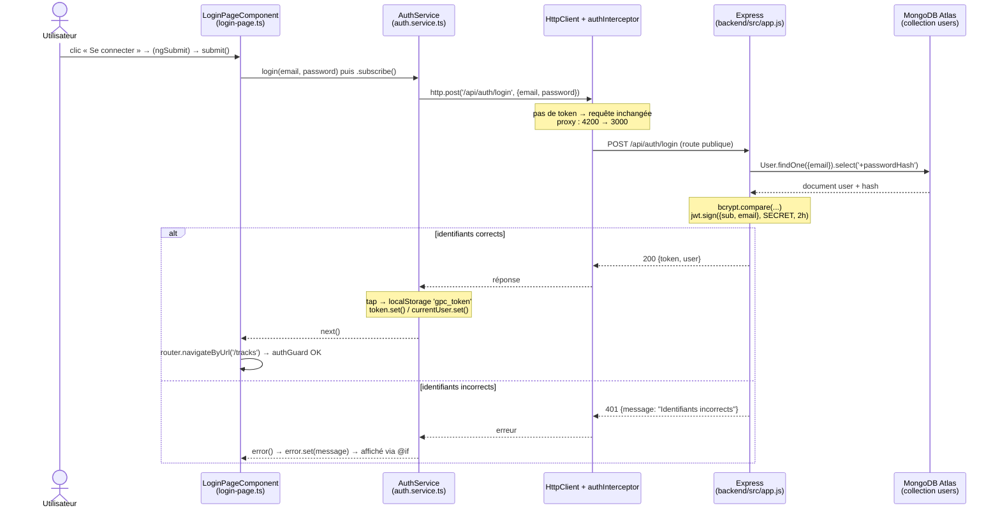

# Rapport TP1 — Architecture Authentification et Profil

## Mission 0 — Cartographier l'application

### 1. Les cinq éléments à retrouver

**Composant racine**
`AppComponent` dans `frontend-starter/src/app/components/app/app.ts`. Son sélecteur `app-root` correspond à la balise `<app-root></app-root>` de `src/index.html`. Son gabarit `app.html` contient l'en-tête avec la navigation conditionnelle et `<router-outlet />`, l'emplacement où s'affiche la page courante.

**Configuration des routes**
Dans `src/app/routes.ts`, activée dans `src/main.ts` via `provideRouter(routes)`. On y trouve :
- `/login` et `/register` — accessibles à tous (routes publiques)
- `/profile` et `/tracks` — protégées par `canActivate: [authGuard]`
- `''` et `**` — redirigent vers `/tracks`

**Enregistrement de `HttpClient`**
Dans `src/main.ts` au démarrage de l'application :
```ts
provideHttpClient(withInterceptors([authInterceptor]))
```
Cette ligne rend `HttpClient` disponible dans toute l'application via `inject()` et branche l'intercepteur sur toutes les requêtes sortantes.

**Modèles, services et pages**

| Catégorie | Fichier | Rôle |
|---|---|---|
| Modèle | `shared/models/user.model.ts` | Forme d'un utilisateur (`id`, `name`, `email`, `createdAt`) |
| Modèle | `shared/models/auth-response.model.ts` | Réponse de login/register : `{ token, user }` |
| Modèle | `shared/models/track.model.ts` | Forme d'une piste audio |
| Modèle | `shared/models/page.model.ts` | Page générique `Page<T>` pour la pagination |
| Service | `shared/services/auth.service.ts` | Login, inscription, profil, déconnexion, Signals `token` et `currentUser` |
| Service | `shared/services/track.service.ts` | Liste, upload, lecture audio |
| Page | `components/login-page/` | Formulaire de connexion |
| Page | `components/register-page/` | Formulaire d'inscription |
| Page | `components/profile-page/` | Affichage et modification du nom |
| Page | `components/tracks-page/` | Bibliothèque audio, upload, lecteur |

**Mécanisme d'ajout du JWT**
Trois pièces travaillent ensemble :
1. `AuthService` stocke le token dans `localStorage` (clé `gpc_token`) et dans le Signal `token` après une connexion réussie.
2. `shared/interceptors/auth.interceptor.ts` lit `token()` à chaque requête ; s'il existe, il clone la requête en ajoutant l'en-tête `Authorization: Bearer <token>`. S'il reçoit une réponse 401 (token invalide ou expiré), il appelle `auth.logout()` et redirige vers `/login`.
3. Côté serveur, le middleware `auth` de `backend/src/app.js` lit cet en-tête et vérifie la signature avec `jwt.verify`.

---

### 2. Flux d'un clic sur « Se connecter »



Annotations par étape :

1. Le clic sur le bouton `type="submit"` déclenche `(ngSubmit)="submit()"` dans `login-page.html`. La méthode `submit()` de `login-page.ts` lit les valeurs avec `this.form.getRawValue()` et appelle `this.auth.login(email, password)`.
2. `AuthService.login()` prépare `this.http.post<AuthResponse>('/api/auth/login', { email, password })`. L'Observable est **paresseux** : c'est le `.subscribe(...)` dans le composant qui déclenche l'envoi.
3. La requête traverse `authInterceptor`. Pas de token à ce stade → la requête passe inchangée. Le proxy de `ng serve` (`proxy.conf.json`) la transfère de `localhost:4200/api/...` vers `localhost:3000/api/...`. Côté Express, elle passe par `cors()`, `express.json()`. Cette route n'a pas de middleware `auth` : elle est publique.
4. Le handler exécute `User.findOne({ email }).select("+passwordHash")`.
5. MongoDB renvoie le document utilisateur avec son hash.
6. `user.verifyPassword()` compare le mot de passe au hash avec `bcrypt.compare`. Si correct, `token(user)` signe un JWT contenant `sub` et `email`, valable 2 heures.
7. Le serveur répond `200` avec `{ token, user: user.toPublic() }`.
8. L'opérateur `tap(...)` d'`AuthService` appelle `storeAuthentication()`, qui écrit le token dans `localStorage` (`gpc_token`), puis met à jour les Signals `token` et `currentUser`.
9. `router.navigateByUrl('/tracks')` déclenche `authGuard`, qui trouve un token et laisse passer.

**Branche d'erreur :** le serveur répond `401 { message: "Identifiants incorrects" }`. Le `tap` n'est pas exécuté, c'est le callback `error` du composant qui est appelé : `this.error.set(...)` et `@if (error())` affiche le message.

---

### 3. Routes publiques et routes protégées

| Méthode | Route | Accès | Rôle |
|---|---|---|---|
| GET | `/api/health` | Publique | Vérifier que le serveur répond |
| POST | `/api/auth/register` | Publique | Créer un compte |
| POST | `/api/auth/login` | Publique | Se connecter |
| GET | `/api/users/me` | Protégée | Lire son profil |
| PUT | `/api/users/me` | Protégée | Modifier son nom |
| GET | `/api/tracks?page=&limit=` | Protégée | Lister ses pistes |
| POST | `/api/tracks` | Protégée | Envoyer un fichier audio |
| GET | `/api/tracks/:id/audio` | Protégée | Écouter une piste |
| DELETE | `/api/tracks/:id` | Protégée | Supprimer une piste |

Les routes publiques sont celles permettant d'obtenir un token. Dans `app.js`, les routes protégées passent le middleware `auth` en deuxième argument : `app.get("/api/users/me", auth, async (req, res) => ...)`.

**Important :** `authGuard` Angular et le middleware Express ne protègent pas la même chose. `authGuard` vérifie seulement qu'un token existe dans le navigateur (confort UX). La vraie sécurité est côté serveur : personne ne peut falsifier la signature d'un JWT sans le secret.

---

## Mission 1 — Inscription, Connexion et Profil

### Routes du backend utilisées

Toutes les routes utilisées par le frontend dans ce TP :

| Composant / Service | Route appelée | Méthode |
|---|---|---|
| `LoginPageComponent` via `AuthService.login()` | `/api/auth/login` | POST |
| `RegisterPageComponent` via `AuthService.register()` | `/api/auth/register` | POST |
| `ProfilePageComponent` via `AuthService.profile()` | `/api/users/me` | GET |
| `ProfilePageComponent` via `AuthService.update()` | `/api/users/me` | PUT |
| `TracksPageComponent` via `TrackService.list()` | `/api/tracks` | GET |
| `TracksPageComponent` via `TrackService.upload()` | `/api/tracks` | POST |
| `TracksPageComponent` via `TrackService.audio()` | `/api/tracks/:id/audio` | GET |

### Où s'effectue la mise à jour du profil utilisateur ?

**Côté frontend :**
- `components/profile-page/profile-page.ts` — méthode `save()` qui appelle `this.auth.update(name)`
- `components/profile-page/profile-page.html` — formulaire avec `(ngSubmit)="save()"`
- `shared/services/auth.service.ts` — méthode `update(name)` qui émet `PUT /api/users/me` et met à jour le Signal `currentUser` via `tap`

**Côté backend :**
- `backend/src/app.js` — route `app.put("/api/users/me", auth, async (req, res) => ...)` qui valide le nom, appelle `user.save()` et retourne `user.toPublic()`
- `backend/src/models/User.js` — modèle Mongoose qui définit le schéma et les méthodes `toPublic()` et `verifyPassword()`

---

## Signal vs `localStorage` — Quelle différence ?

Ces deux mécanismes servent à stocker l'état de l'utilisateur connecté, mais ils ont des rôles complémentaires :

**`localStorage`** est un stockage **persistant dans le navigateur**. Sa valeur survit à un rechargement de page ou à la fermeture et réouverture de l'onglet. Il est lu une seule fois au démarrage de l'application (dans `AuthService` : `signal<string | null>(localStorage.getItem('gpc_token'))`). Il ne déclenche aucune réaction automatique dans Angular.

**Signal Angular** est un stockage **réactif en mémoire**. Quand sa valeur change (via `.set()`), Angular recalcule automatiquement tous les composants et Signals calculés (`computed`) qui en dépendent. Par exemple, quand `token.set(null)` est appelé dans `logout()`, le Signal calculé `isLoggedIn` repasse à `false` instantanément, et le template `app.html` bascule la navigation de « Profil / Tracks / Déconnexion » vers « Connexion / Inscription » sans aucun rechargement.

**Résumé :** `localStorage` garantit la **persistence** (l'utilisateur reste connecté après F5), le Signal garantit la **réactivité** (l'UI se met à jour immédiatement quand l'état change). Les deux sont nécessaires et complémentaires dans `AuthService`.

---

## Checkpoint Network

Observations à effectuer dans l'onglet **Network** des DevTools (filtre XHR/Fetch) :

### 1. Connexion réussie

- **Méthode / URL :** `POST /api/auth/login`
- **Corps JSON envoyé :** `{ "email": "demo@example.com", "password": "Demo1234!" }` *(ne jamais capturer un vrai mot de passe)*
- **Statut :** `200 OK`
- **Réponse :** `{ "token": "eyJ...", "user": { "id": "...", "name": "Demo", "email": "demo@example.com", "createdAt": "..." } }`
- **En-tête `Authorization` :** absent (route publique, pas de token envoyé)

### 2. Connexion refusée

- **Méthode / URL :** `POST /api/auth/login`
- **Statut :** `401 Unauthorized`
- **Réponse :** `{ "message": "Identifiants incorrects" }`
- **Effet UI :** le message d'erreur s'affiche sous le formulaire via `@if (error())`

### 3. Lecture ou modification de `/api/users/me`

- **GET `/api/users/me`** — `200 OK` avec le profil utilisateur ; en-tête `Authorization: Bearer eyJ...` visible dans les Request Headers
- **PUT `/api/users/me`** — corps `{ "name": "Nouveau nom" }` ; `200 OK` avec l'utilisateur mis à jour

---

## Usage de l'IA

Voir le fichier `RAPPORT_IA_MODELE.md` pour le détail de l'usage de l'assistant IA, les prompts utilisés, les vérifications effectuées et ce que chaque membre du binôme sait maintenant expliquer sans l'agent.
